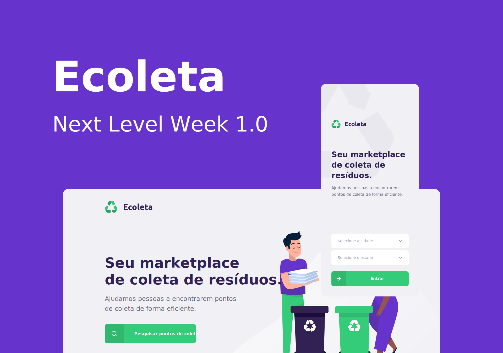

<!-- Cover -->
[](https://nextlevelweek.com)

<!-- Badges -->
[](https://github.com/guiribmedeiros/ecoleta-web/search?l=typescript)
[](./LICENSE.md)
[](https://github.com/guiribmedeiros/ecoleta-web/issues)

## About Ecoleta

Ecoleta is a marketplace platform that helps people find collection points for recyclable materials efficiently. This project was developed for the **International Environment Week** during the [Next Level Week](https://nextlevelweek.com) 1.0 by [@rocketseat](https://github.com/rocketseat). Ecoleta takes the pain out recycling waste by connecting people with collection points, see more:

- Booster [Ecoleta API](https://github.com/guiribmedeiros/ecoleta-api).
- Booster [Ecoleta Mobile](https://github.com/guiribmedeiros/ecoleta-mobile).
- Starter and Booster designs are available at [Figma](https://www.figma.com/file/RdlEdkUng704Q0OyIHjSGi/Ecoleta).

Ecoleta Web is an open-sourced web app. It is written in [TypeScript](http://www.typescriptlang.org) and
uses [React](https://reactjs.org/).

## Getting Started

First, let’s make sure that your development environment is ready.

- If you don’t have **Node.js** installed, [install it from here](https://nodejs.org/).

Then configure your development environment from the `.env.example` file and install the dependencies from your project’s `package.json` file by running the following command:

```
npm install
```

Finally, after installing the dependencies, the `start` script starts your React "development server" on port 3000.

```
npm start
```

That’s it! :rocket:  
If you have questions about Ecoleta Web, you can ask on [GitHub Issues](https://github.com/guiribmedeiros/ecoleta-web/issues).
